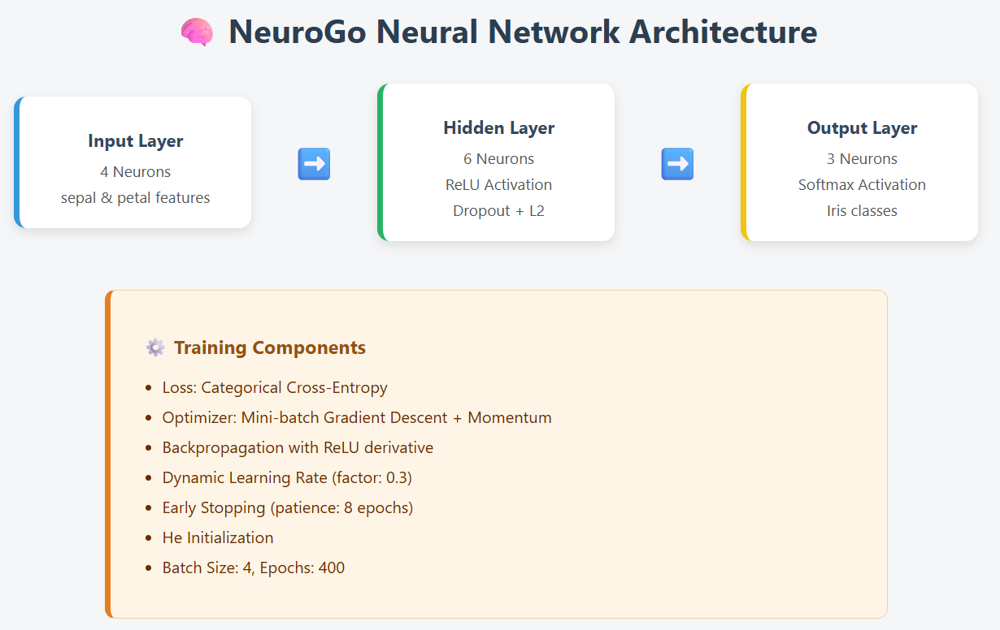

# NeuroGo: Neural Network Implementation in Go

A minimal neural network framework.

NeuroGo lets you build, train, and interactively explore feedforward neural networks with features like ReLU, Softmax, Dropout, Backpropagation, Class Weights, Early Stopping, and more.

## Evaluating model

## Confusion Matrix

## Features

- Feedforward architecture with arbitrary layers
- ReLU activation and Softmax output
- He initialization for weights
- Dropout regularization (customizable rate)
- Cross-Entropy loss with class weighting
- Backpropagation with momentum and L2 regularization
- Dynamic learning rate reduction
- Early stopping based on loss plateau
- Batch training with shuffling
- CLI support for training and interactive prediction

## Model Details

- Architecture: Defined via NewNeuralNet([]int{input, hidden1, ..., output}, learningRate)
- Loss: Cross-Entropy with weighted targets for imbalance
- Eval: Returns accuracy, average loss on the dataset
- Dropout: Active during training only
- Softmax: Applied to output layer during prediction

## License

This project is licensed under the MIT License - see the LICENSE file for details. 